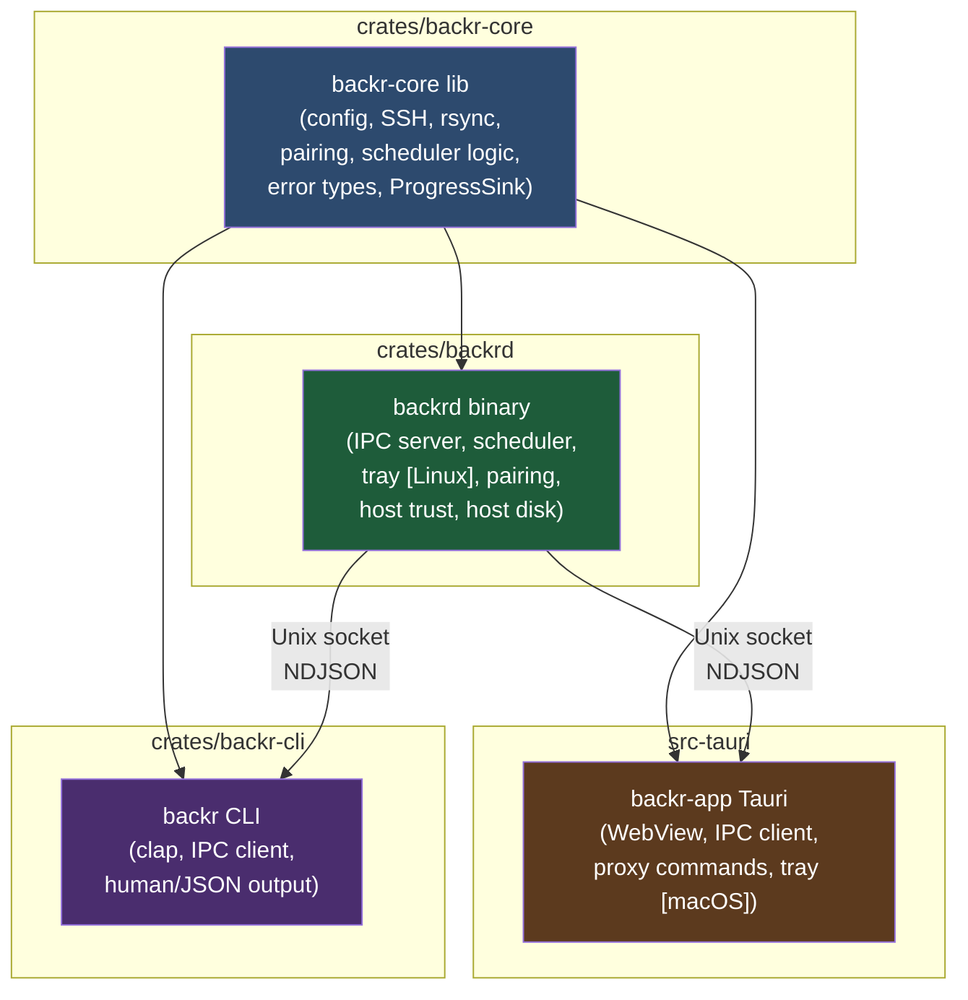
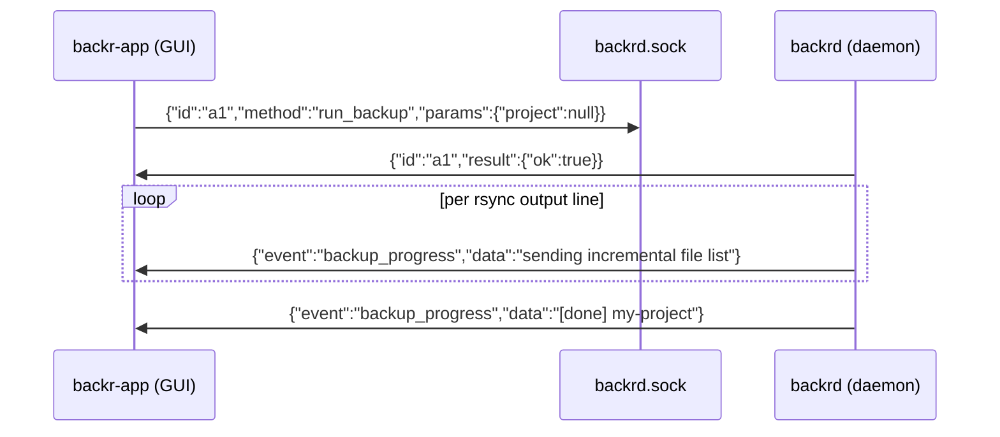
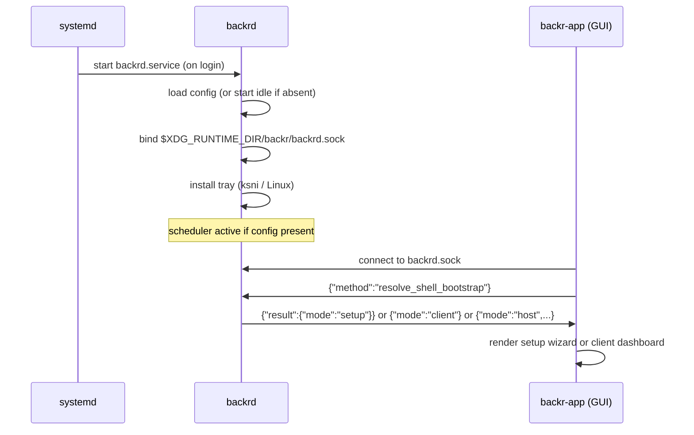

# feat: Separate backrd daemon from GUI

## Summary

Extract the scheduler, SSH/rsync execution, pairing, and tray out of the Tauri process into
a standalone `backrd` daemon that runs under systemd (Linux) or launchd (macOS). The Tauri
GUI and a new `backr` CLI become thin clients that communicate with the running daemon via a
Unix socket JSON IPC protocol. The window can be truly closed and relaunched freely; `backrd`
keeps the scheduler alive and owns the system tray independently.

---

## Problem Frame

The scheduler, SSH keep-alive, rsync jobs, and tray icon all run inside the single Tauri
process that owns the window. Closing the window kills the scheduler, so `on_window_event`
intercepts `CloseRequested` and hides the window instead. This produces a process that the
user cannot actually exit from the window, and whose stale in-memory state persists across
config changes made on disk (e.g. a reinstall that clears `~/.config/backr/`). The fix
applied in `src/App.svelte` (re-bootstrap on window focus) treats a symptom; this plan
removes the root cause.

---

## Requirements

**Daemon**
- R1. `backrd` starts at user login via a systemd user service (Linux) or launchd user agent (macOS), registered by the install scripts.
- R2. `backrd` owns the backup scheduler, fires rsync jobs, and updates the system tray tooltip without requiring the GUI to be open.
- R3. `backrd` listens on a Unix domain socket for JSON IPC from the GUI and CLI.
- R4. `backrd` handles the full pairing protocol — mDNS advertising, tiny_http handshake, key exchange — on both client and host sides.
- R5. `backrd` starts successfully with no config file; tray shows "Not configured — open Backr to pair." Scheduler activates once a valid config is received via IPC.
- R6. `backrd` pushes progress events (backup line-by-line output, status changes) over the open socket connection(s) so the GUI can stream them when connected.
- R7. On the host, `backrd` handles the full host trust command set (authorized_keys read/write/list/remove) and disk inventory locally.

**GUI (`backr` Tauri app)**
- R8. The Tauri `on_window_event` `CloseRequested` handler is removed; the window closes cleanly.
- R9. On launch the GUI connects to `backrd.sock`; if the daemon is unreachable and cannot be started, the GUI fails with a clear error (no fallback to embedded logic).
- R10. All 26 Tauri command implementations proxy to the daemon over IPC; the Svelte frontend is unchanged (same `invoke` call names and response shapes).
- R11. `resolve_shell_bootstrap` queries the daemon for its current state (setup / client / host) rather than reading the filesystem directly.

**CLI (`backr` binary)**
- R12. A new `backr` CLI binary connects to `backrd.sock`, sends a JSON command, prints the result, and exits.
- R13. Core commands: `backup [project]`, `status`, `list [project]`, `config get <key>`, `config set <key> <value>`, `pair`, `snapshots [project]`.
- R14. Host commands: `trust add <pubkey>`, `trust list`, `trust remove <id>`.
- R15. `--json` flag emits machine-readable output; default is human-readable.

**Install scripts**
- R16. `setup-connecting-client.sh` installs `backrd`, writes a systemd user service unit, and enables + starts it.
- R17. `setup-backup-host.sh` does the same for the host.

---

## Key Technical Decisions

**KTD-1 — Cargo workspace with three crates.**
The current single `src-tauri/` crate splits into: `backr-core` (shared lib: config, error
types, SSH, rsync, pairing, scheduler, host trust), `backrd` (daemon binary: IPC server,
tray, systemd integration), and the existing `src-tauri/` Tauri app (renamed mentally to
`backr-app`; the CLI becomes `crates/backr-cli/`). The workspace root `Cargo.toml` declares
all four members. `src-tauri/` stays in place to preserve the Tauri build system conventions;
`crates/` holds the new members.

**KTD-2 — Unix socket at `$XDG_RUNTIME_DIR/backr/backrd.sock`.**
`XDG_RUNTIME_DIR` (typically `/run/user/1000`) is cleaned up by systemd on logout and is not
world-readable. The daemon creates `$XDG_RUNTIME_DIR/backr/` (mode 0700) on startup.
Fallback when `XDG_RUNTIME_DIR` is unset: `~/.local/share/backr/backrd.sock` (mode 0600).
The GUI and CLI use the same resolution logic. This avoids a port allocation and keeps the
socket user-private without explicit `chmod`.

**KTD-3 — Line-delimited JSON (NDJSON) IPC protocol.**
Each message is one JSON object per line (`\n`-terminated). Requests: `{ "id": "<uuid>",
"method": "<name>", "params": { ... } }`. Responses: `{ "id": "<uuid>", "result": { ... } }`
or `{ "id": "<uuid>", "error": { "kind": "<ErrorKind>", "message": "<text>" } }`. Push events
(daemon → client): `{ "event": "<name>", "data": <any> }` — no `id` field; clients filter
events by name. Multiple GUI/CLI connections are multiplexed concurrently via Tokio tasks; the
daemon broadcasts push events to all active connections. This reuses the existing
`BackrCommandError { kind, message }` shape on the wire so frontend error routing is
unchanged.

**KTD-4 — `ProgressSink` trait extended with an IPC variant.**
The existing `ProgressSink` trait (`progress_sink.rs`) has `AppEmitProgress` (Tauri emit) and
`CollectLines` (tests). A new `IpcBroadcastSink` in `backrd` holds a channel sender and
broadcasts `{ "event": "backup_progress", "data": "<line>" }` to all open connections. The
backup pipeline is unchanged — it calls `sink.backup_progress_line(line)`. `AppEmitProgress`
stays in `src-tauri/` for the existing Tauri event path; when the GUI is a proxy, backup
progress arrives over the socket and the Tauri command re-emits it locally via Tauri's
`emit("backup://progress", line)`.

**KTD-5 — `ksni` for the daemon system tray on Linux.**
Tauri's tray API is unavailable in `backrd`. `ksni` is a pure-Rust async StatusNotifierItem
implementation (DBUS, no GTK event loop required), compatible with GNOME, KDE, and
`libappindicator`-aware environments. It integrates directly with the Tokio runtime already
present in `backrd`. macOS daemon tray is deferred — `backrd` runs headlessly on macOS; the
Tauri GUI retains the tray on macOS until a follow-up pass adds a native macOS tray to
`backrd`.

**KTD-6 — `backrd` starts `backr-app` when the tray "Open Backr" item is clicked.**
The daemon spawns `backr-app` as a child process (via `std::process::Command` / `tokio::process::Command`).
The GUI uses `tauri_plugin_single_instance` to prevent duplicate windows — the second
invocation signals the first to show its window. On macOS (headless daemon), the tray lives
in the Tauri process; clicking "Open Backr" is a no-op (the window is already the primary
surface).

**KTD-7 — GUI fails hard when daemon is unreachable.**
If `backrd.sock` does not exist and spawning the daemon fails, the Tauri app renders an error
screen with the daemon's stderr and a "Retry" button. No fallback to embedded logic. This
keeps a single code path active and surfaces misconfigured installs explicitly.

**KTD-8 — `backr` CLI binary replaces the Tauri binary name.**
The CLI binary is named `backr`. The Tauri desktop app is distributed as `Backr` (its app
name) and invoked via the `.desktop` launcher; its binary on disk is `backr-app`. The install
scripts update the `Exec=` field in the `.desktop` entry to `backr-app`, add `backrd` and
`backr` to `~/.local/bin/` (or `~/.local/share/backr/`).

---

## High-Level Technical Design

### Component topology



### IPC message flow (backup triggered from GUI)



### Startup sequence (client machine)



---

## Output Structure

New directories and crates introduced by this plan:

```
crates/
  backr-core/
    Cargo.toml
    src/
      lib.rs
      backup/      (moved from src-tauri/src/backup/)
      pairing/     (moved from src-tauri/src/pairing/)
      config.rs
      error.rs
      host_config.rs
      host_disk_inventory.rs
      host_trust.rs
      progress_sink.rs
      project_snapshot_cache.rs
      scheduler.rs
  backrd/
    Cargo.toml
    src/
      main.rs
      daemon_state.rs
      ipc/
        mod.rs       (server, accept loop)
        protocol.rs  (request/response/event types)
        handlers.rs  (dispatch table, one fn per method)
      scheduler.rs   (thin wrapper over backr-core scheduler, IPC sink)
      tray.rs        (ksni integration, Linux-only)
      event_sink.rs  (IpcBroadcastSink: ProgressSink impl)
  backr-cli/
    Cargo.toml
    src/
      main.rs        (clap app, subcommand dispatch)
      client.rs      (socket connect, send/recv helpers)
      output.rs      (human-readable formatters)
scripts/
  backrd.service.template     (systemd user service unit)
  backrd.plist.template       (launchd user agent, macOS)
```

---

## Scope Boundaries

**In scope:**
- Cargo workspace restructure with `backr-core`, `backrd`, `backr-cli` crates
- `backrd` daemon: IPC server, scheduler, pairing (client + host), host trust, host disk ops
- `backr-cli` with the 13 commands listed in R12–R14
- All 26 Tauri commands become IPC proxies; Svelte frontend unchanged
- `on_window_event` prevent\_close removed; window closes cleanly
- Linux daemon tray via `ksni`
- systemd user service + launchd plist templates; install script integration (R16–R17)

**Deferred to follow-up work:**
- macOS daemon tray (daemon runs headlessly on macOS; Tauri tray retained for macOS)
- Windows support (named pipes instead of Unix sockets)
- `backr update` CLI command / daemon auto-update
- Remote CLI (SSH tunnel to another machine's `backrd.sock`)
- Web UI served by `backrd`

**Outside this product's identity:**
- Multi-user daemon (daemon always runs as the login user)
- Changing the backup protocol (rsync over SSH stays)

---

## Risks & Dependencies

- **ksni environment compatibility.** StatusNotifierItem requires a compliant system tray host
  (KDE Plasma, GNOME with AppIndicator extension, etc.). GNOME without the extension shows no
  tray icon. Mitigation: document the requirement; the daemon starts and backs up normally
  without a tray — the tray is an optional surface.
- **`XDG_RUNTIME_DIR` in systemd user sessions.** Some minimal Linux installs lack systemd
  user session support; `XDG_RUNTIME_DIR` may be unset. The fallback path
  (`~/.local/share/backr/backrd.sock`) handles this but lacks the automatic cleanup.
- **Tauri single-instance plugin behaviour after split.** Currently the plugin reveals the
  existing window. After the split, the plugin still prevents duplicate GUI windows, but the
  "existing instance" reveal must now work across true process restarts (daemon up, GUI
  restarted). The plugin's `on_new_instance` callback changes to a no-op window reveal (window
  is already visible); the daemon is not involved.
- **`tiny_http` OS-thread pairing server.** The pairing server runs on a blocking OS thread
  today. Moving it into `backrd` (which has a Tokio runtime) requires the same `thread::spawn`
  + `block_in_place` approach used in the current implementation — no change needed.
- **Privileged trust helper on host.** `host_trust.rs` calls `sudo -n` and the
  `/usr/local/lib/backr/append-trusted-key` helper. These run as child processes from
  `backrd`; the sudoers drop-in written by `setup-backup-host.sh` already grants this. No
  change to the escalation model.

---

## Implementation Units

### Phase 1 — Workspace + Shared Core Crate

### U1. Create Cargo workspace and `backr-core` crate skeleton

**Goal:** Introduce the workspace root and stub `backr-core` so downstream crates can depend
on it; no logic moves yet.

**Requirements:** KTD-1

**Dependencies:** none

**Files:**
- `Cargo.toml` — new workspace manifest (members: `src-tauri`, `crates/backr-core`, `crates/backrd`, `crates/backr-cli`)
- `crates/backr-core/Cargo.toml` — lib crate, inherits workspace deps
- `crates/backr-core/src/lib.rs` — empty `pub mod` stubs for each module to migrate

**Approach:** The existing `src-tauri/Cargo.toml` becomes a workspace member. Duplicate no
logic; this unit is structural scaffolding only. Add a `[workspace.dependencies]` table for
shared deps (`tokio`, `serde`, `serde_json`, `toml`, `chrono`, `thiserror`, `tracing`,
`regex`, `once_cell`, `dirs`, `shell-escape`, `shellexpand`, `rand`, `tiny_http`, `mdns-sd`)
so versions stay consistent across crates.

**Patterns to follow:** Workspace `Cargo.toml` convention; `src-tauri/Cargo.toml` keeps its
`[package]` and `[dependencies]` but inherits shared deps via `dep = { workspace = true }`.

**Test scenarios:**
- `cargo build --workspace` compiles without errors after the restructure.
- `cargo test --workspace` runs existing tests (all in `src-tauri`) without regressions.

**Verification:** `cargo check --workspace` passes with zero errors. Existing test suite
passes unchanged.

---

### U2. Move non-Tauri modules to `backr-core`; replace `AppHandle` with trait abstractions

**Goal:** All business logic that does not depend on `AppHandle` or Tauri types lives in
`backr-core`; `src-tauri` depends on `backr-core` and re-exports only what the Tauri command
layer needs.

**Requirements:** KTD-1, KTD-4, R2, R4, R7

**Dependencies:** U1

**Files:**
- `crates/backr-core/src/` — add: `backup/`, `pairing/`, `config.rs`, `error.rs`,
  `host_config.rs`, `host_disk_inventory.rs`, `host_trust.rs`, `progress_sink.rs`,
  `project_snapshot_cache.rs`, `scheduler.rs`
- `src-tauri/src/` — delete migrated modules; add `use backr_core::*` re-exports as needed
- `src-tauri/src/progress_sink.rs` — retain `AppEmitProgress` (Tauri-specific); import
  `ProgressSink` trait and `CollectLines` from `backr-core`

**Approach:** Move files physically. Replace any `AppHandle` argument in moved functions with
a trait parameter or return value. Concretely: `scheduler::restart_scheduler` currently takes
`AppHandle` to call `spawn_backup_job`; replace with a `BackupTrigger` closure or trait that
the Tauri app and daemon each implement differently. `progress_sink::AppEmitProgress` stays in
`src-tauri`; the trait and `CollectLines` move to `backr-core`. The `pairing/listener.rs`
`tiny_http` server has no Tauri types — moves as-is.

**Patterns to follow:** `src-tauri/src/backup/ssh.rs` has no Tauri imports — move
verbatim. `src-tauri/src/commands/backup_cmd.rs` has heavy `AppHandle` usage — stays in
`src-tauri` for now (converted to IPC proxy in U9).

**Test scenarios:**
- Each moved module compiles in `backr-core` without Tauri feature flags.
- All existing unit tests (ssh path joins, snapshot name validation, error serialization) pass
  in `backr-core`.
- `src-tauri` still compiles and the app launches and backs up successfully after the move.

**Verification:** `cargo test -p backr-core` passes. App builds and a manual backup run
succeeds.

---

### Phase 2 — `backrd` Daemon Binary

### U3. `backrd` crate: IPC server + daemon state

**Goal:** `backrd` binary starts, binds the Unix socket, accepts connections, and dispatches
JSON requests to stub handlers. DaemonState mirrors AppState without Tauri types.

**Requirements:** KTD-2, KTD-3, R3, R5

**Dependencies:** U2

**Files:**
- `crates/backrd/Cargo.toml`
- `crates/backrd/src/main.rs`
- `crates/backrd/src/daemon_state.rs`
- `crates/backrd/src/ipc/mod.rs` — `UnixListener` accept loop; per-connection Tokio task
- `crates/backrd/src/ipc/protocol.rs` — `IpcRequest`, `IpcResponse`, `IpcEvent` serde types; `ErrorKind` re-exported from `backr-core`

**Approach:** `main()` resolves the socket path (KTD-2), calls `tokio::fs::create_dir_all`
on the parent, removes a stale socket if present, and binds `UnixListener`. Each accepted
connection spawns a task that reads NDJSON lines, dispatches to `handlers::dispatch`, and
writes the response. `DaemonState` contains the fields from `AppState` relevant to the daemon:
`config: Mutex<Option<Config>>`, `in_progress: AtomicBool`, `last_backup_at:
Mutex<Option<DateTime<Utc>>>`, `scheduler_handle/cancel`, `pairing: Mutex<Option<PairingSession>>`. GUI-only fields (`active_project` display state) are dropped from daemon state.

**Patterns to follow:** Tokio `UnixListener` / `UnixStream` accept pattern. Socket path
resolution mirrors `config::ssh_control_dir` pattern.

**Test scenarios:**
- `backrd` starts and creates the socket file at the expected path.
- Sending `{"id":"1","method":"ping","params":{}}` over the socket returns
  `{"id":"1","result":{"pong":true}}`.
- Sending malformed JSON returns `{"id":null,"error":{"kind":"InvalidInput","message":"..."}}`.
- Starting a second `backrd` while one is running: second process detects the socket is alive
  and exits cleanly (or replaces stale socket if the first process is dead).

**Verification:** `backrd &` then `echo '{"id":"1","method":"ping","params":{}}' | nc -U
$XDG_RUNTIME_DIR/backr/backrd.sock` returns a valid response.

---

### U4. Daemon scheduler + `IpcBroadcastSink`

**Goal:** `backrd` runs the backup scheduler and emits `backup_progress` events to all open
socket connections.

**Requirements:** KTD-4, R2, R6

**Dependencies:** U3

**Files:**
- `crates/backrd/src/event_sink.rs` — `IpcBroadcastSink` implementing `ProgressSink`
- `crates/backrd/src/scheduler.rs` — thin wrapper: calls `backr_core::scheduler::restart_scheduler` with `IpcBroadcastSink` and a channel for daemon-side backup completion notification

**Approach:** `IpcBroadcastSink` holds a `tokio::sync::broadcast::Sender<IpcEvent>`. Each
accepted connection subscribes with `sender.subscribe()` and forwards received events to its
socket writer. The scheduler loop calls `backr_core::scheduler` functions (now in
`backr-core`) with the broadcast sink. After each successful backup, the scheduler calls
`tray::update_tooltip(state)` to refresh the tray text.

**Patterns to follow:** `src-tauri/src/scheduler.rs` scheduler loop structure; `src-tauri/src/progress_sink.rs` trait impl pattern.

**Test scenarios:**
- After `save_config` IPC call with a 1-second interval, the scheduler fires within 2 seconds
  (use `CollectLines` sink in integration test).
- `backup_progress` events are received on all open connections simultaneously when a backup
  runs.
- Cancelling the scheduler (via config change IPC) stops further backup ticks.

**Verification:** `backrd` starts and fires a backup after the configured interval; progress
lines appear on a `nc -U` session connected to the socket.

---

### U5. Daemon IPC handlers: all 26 commands

**Goal:** All 26 commands (see research taxonomy) are implemented as IPC handlers in `backrd`;
stub responses are replaced with real logic ported from `src-tauri/src/commands/`.

**Requirements:** R4, R5, R6, R7, KTD-3

**Dependencies:** U3, U4

**Files:**
- `crates/backrd/src/ipc/handlers.rs` — `async fn dispatch(method, params, state) -> IpcResponse`; one match arm per method name

**Approach:** Group handlers by domain to match the command taxonomy from research:
- Backup: `run_backup`, `get_backup_status`, `get_activity_series`
- Config: `get_config`, `save_config` (also restarts scheduler), `test_connection`, `get_system_info`, `resolve_shell_bootstrap`
- Project: `list_projects`
- Snapshot: `list_snapshots`, `list_files`, `read_snapshot_file`, `restore_snapshot`, `restore_all_snapshots`, `restore_all_projects`
- Pairing: `start_pairing`, `stop_pairing`, `pairing_status`, `discover_hosts`, `pair_with_host`, `confirm_pairing`
- Host: `host_list_snapshot_projects`, `host_volume_summary`, `host_disk_inventory`, `host_trust_status`, `host_append_authorized_pubkey`, `host_list_authorized_pubkeys`, `host_remove_authorized_pubkey`

Port each handler body directly from the corresponding `src-tauri/src/commands/*.rs` file,
replacing `AppHandle`/Tauri-specific types with `Arc<DaemonState>` and `IpcBroadcastSink`.
The `restore_*` commands emit progress events via the broadcast sink. `resolve_shell_bootstrap`
reads the host marker + config from daemon state and returns `{ "mode": "setup"/"client"/"host", ... }`.

**Patterns to follow:** Existing command implementations in `src-tauri/src/commands/`; error
mapping via `BackrCommandError::from(BackrError)` (already in `backr-core`).

**Test scenarios:**
- `get_config` returns `null` before a config is saved, and the correct config object after.
- `save_config` with a valid config persists to disk and restarts the scheduler.
- `run_backup` while `in_progress` is true returns `{"kind":"BackupInProgress","message":"..."}`.
- `start_pairing` returns a 6-digit code and subsequent `pairing_status` returns `true`.
- `host_trust_status` returns key count matching `authorized_keys` content.
- `resolve_shell_bootstrap` returns `"setup"` when no config exists, `"client"` when config
  present, `"host"` when `/etc/backr/host.toml` exists.

**Verification:** Each handler group exercised via `nc -U` or an integration test that spawns
`backrd` and sends JSON over the socket.

---

### U6. Daemon tray (Linux, `ksni`)

**Goal:** `backrd` shows a system tray icon on Linux with "Open Backr", "Back Up Now",
"Status", and "Quit" items; tray tooltip shows last backup time.

**Requirements:** R2, KTD-5, KTD-6

**Dependencies:** U4

**Files:**
- `crates/backrd/src/tray.rs` — `ksni::Tray` implementation; item structs; spawn/update functions
- `crates/backrd/Cargo.toml` — add `ksni` (linux target only via `[target.'cfg(target_os = "linux")'.dependencies]`)

**Approach:** Implement `ksni::Tray` for a struct holding `last_backup_label: String` and an
`AppHandle`-equivalent notifier channel. `ksni::run` spins the tray in a Tokio task. "Back Up
Now" sends `run_backup` into the daemon handler directly (in-process call, not a socket
round-trip). "Open Backr" calls `tokio::process::Command::new("backr-app").spawn()`. "Quit"
calls `std::process::exit(0)`. After each backup tick, `DaemonState::last_backup_at` is
updated and `tray::update_label(state)` refreshes the ksni item title.

**Patterns to follow:** `src-tauri/src/tray.rs` menu item structure and tooltip update
pattern; replace Tauri tray calls with `ksni` equivalents.

**Test scenarios:**
- Tray item `ksni::Tray::title()` returns "Backr — last backup: never" before any backup,
  "Backr — last backup: YYYY-MM-DD HH:MM UTC" after one.
- `#[cfg(not(target_os = "linux"))]` compiles without the `ksni` feature (macOS headless).
- "Back Up Now" triggers backup execution (verify via `IpcBroadcastSink` message in test).

**Verification:** `backrd` starts and a tray icon appears in the system tray on Linux. All
four menu items render. "Quit" exits the daemon process.

---

### Phase 3 — CLI + Tauri Proxy + Service Registration

### U7. `backr-cli` binary

**Goal:** `backr` CLI connects to `backrd.sock` and exposes the commands in R12–R14 as
subcommands.

**Requirements:** R12, R13, R14, R15, KTD-8

**Dependencies:** U3, U5

**Files:**
- `crates/backr-cli/Cargo.toml` — add `clap` (derive feature), `serde_json`, `tokio`
- `crates/backr-cli/src/main.rs` — `clap` app definition; subcommand dispatch
- `crates/backr-cli/src/client.rs` — `connect()` → `UnixStream`; `send_request()` / `recv_response()` helpers; event loop for streaming progress
- `crates/backr-cli/src/output.rs` — human-readable formatters for each response type; `--json` bypass

**Approach:** Each subcommand serializes its args into an `IpcRequest`, sends via the socket
helper, and prints the result. `backup [project]` additionally streams `backup_progress` events
as they arrive (reads until the socket closes the response or a `backup_done` event is received).
`pair` runs an interactive terminal prompt (stdin read for the 6-digit code and fingerprint
confirmation), calling `discover_hosts` → user picks → `pair_with_host` → prints fingerprint →
user confirms → `confirm_pairing` → `save_config`. `--json` prints the raw `IpcResponse.result`
JSON without formatting.

**Patterns to follow:** `src-tauri/src/pairing/client.rs` for the pair flow sequence;
`crates/backrd/src/ipc/protocol.rs` for message types (shared from `backr-core` or
re-imported from `backrd`).

**Test scenarios:**
- `backr status` prints last backup time and next scheduled time in human-readable form.
- `backr backup` streams progress lines to stdout and exits 0 on success, 1 on error.
- `backr status --json` prints a valid JSON object.
- `backr status` when daemon is not running prints "Backr daemon is not running. Start it
  with: systemctl --user start backrd" and exits 1.
- `backr config get remote.host` prints the current host value.
- `backr config set schedule.interval_hours 6` updates config and the daemon restarts its
  scheduler.

**Verification:** CLI binary built; `backr status`, `backr backup`, `backr config get remote.host`
all return correct output against a running `backrd`.

---

### U8. Convert Tauri commands to IPC proxies

**Goal:** All 26 Tauri commands forward their arguments to `backrd` over the Unix socket and
return the daemon's response; backup progress events from the socket are re-emitted as Tauri
`backup://progress` events.

**Requirements:** R8, R9, R10, R11

**Dependencies:** U3, U5

**Files:**
- `src-tauri/src/ipc_client.rs` — `DaemonClient`: connect, `call(method, params)`, streaming `subscribe_events()`
- `src-tauri/src/commands/` — all `*_cmd.rs` files: replace body with `client.call(...)` proxy
- `src-tauri/src/commands/backup_cmd.rs` — `run_backup` proxies the call and spawns a task to receive `backup_progress` events and re-emit via `app.emit("backup://progress", line)`
- `src-tauri/src/lib.rs` — remove scheduler start, tray creation; add daemon liveness check + spawn on startup (KTD-7)

**Approach:** `DaemonClient::connect()` resolves the socket path (shared logic from
`backr-core`) and opens a `tokio::net::UnixStream`. Each proxy command does:
`client.call("method_name", json!(params)).await` and maps the IPC response shape to the
existing Tauri `Result<T, BackrCommandError>` return type. The `BackrCommandError`
deserialization reuses the existing `ErrorKind` shape from the wire (KTD-3). In `lib.rs`,
`setup()` attempts `DaemonClient::connect()`; if it fails, it calls
`tokio::process::Command::new("backrd").spawn()` once, waits up to 3 s for the socket to
appear, and if still unreachable renders the error screen (KTD-7).

`on_window_event` `CloseRequested` handler is removed entirely. `tauri_plugin_single_instance`
callback changes to just `w.show(); w.set_focus()` (daemon always keeps running; only the
window is new).

**Patterns to follow:** Existing command return types in `src-tauri/src/commands/`; `ipc/protocol.rs` message shapes.

**Test scenarios:**
- `invoke("get_config")` returns the config from the daemon (integration: start daemon with
  known config, then start GUI and invoke).
- `invoke("run_backup")` triggers a backup in the daemon; `backup://progress` events are
  received in the Tauri frontend (verify via mock progress sink that broadcasts test lines).
- `invoke("resolve_shell_bootstrap")` returns `"setup"` when daemon has no config.
- Closing the Tauri window exits the process; `backrd` continues running and fires the next
  scheduled backup.
- Launching a second GUI instance shows the existing window (single-instance plugin) without
  starting a second daemon.
- If `backrd` is not running and cannot be spawned, the GUI shows the error screen (not a
  crash or blank window).

**Verification:** App launches, connects to daemon, all existing UI flows work (backup,
snapshot browse, settings, pairing). Window closes without prompting. Relaunch reconnects.

---

### U9. Install script service registration

**Goal:** Install scripts register `backrd` as a systemd user service (Linux) or launchd user
agent (macOS) and start it; `backr` and `backr-app` binaries are placed correctly.

**Requirements:** R16, R17, KTD-8

**Dependencies:** U6, U7, U8

**Files:**
- `scripts/backrd.service.template` — systemd unit with `%h` home expansion, `Restart=on-failure`, `ExecStart=%h/.local/share/backr/backrd`
- `scripts/backrd.plist.template` — launchd `com.backr.daemon.plist` for `~/Library/LaunchAgents/`
- `scripts/setup-connecting-client.sh` — add `install_daemon_service()`: install `backrd` binary, `backr` CLI binary, write and enable systemd unit; update `.desktop` `Exec=backr-app`
- `scripts/setup-backup-host.sh` — same `install_daemon_service()` call

**Approach:** After building or downloading the binaries, `install_daemon_service()`:
1. Copies `backrd` to `~/.local/share/backr/backrd` and `backr` to `~/.local/bin/backr`.
2. Writes the systemd unit to `~/.config/systemd/user/backrd.service` (from template with path substitution).
3. Calls `systemctl --user daemon-reload && systemctl --user enable --now backrd`.
4. On macOS: writes plist to `~/Library/LaunchAgents/com.backr.daemon.plist` and calls
   `launchctl load`.
5. Updates the `.desktop` entry `Exec=` line to `backr-app` (rename from `backr`).

`uninstall_backr()` in `setup-connecting-client.sh` gains: `systemctl --user disable --now backrd; rm ~/.config/systemd/user/backrd.service`.

**Patterns to follow:** Existing `install_app_build_and_integrate` function in
`setup-connecting-client.sh` for binary copy + desktop entry pattern.

**Test scenarios:**
- After running `setup-connecting-client.sh`, `systemctl --user status backrd` shows `active (running)`.
- `backr status` returns daemon state without manually starting `backrd`.
- Logging out and back in (simulated by `loginctl terminate-session` + new session): `backrd`
  starts automatically.
- `setup-connecting-client.sh --uninstall` stops and removes the service unit.

**Verification:** Fresh install on a Debian/Ubuntu machine; after the script completes,
`backrd` is running and `backr status` works without manual daemon start.

---

## Open Questions

- **IpcRequest params schema**: The exact JSON field names for each method's `params` object
  are deferred to implementation — derive from existing Tauri command argument names
  (already camelCase from Tauri's renaming) to minimize frontend churn.
- **Socket permissions on macOS**: `XDG_RUNTIME_DIR` does not exist on macOS; the fallback
  path (`~/.local/share/backr/backrd.sock`) must be validated on macOS under launchd.
  Implementation should verify mode 0600 on socket creation.
- **Daemon upgrade stop sequence**: When the install script re-runs, `backrd` must be stopped
  before the binary is replaced. Add `systemctl --user stop backrd` before the binary copy
  step; restart after.
